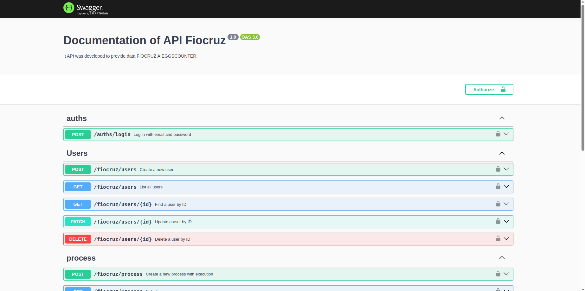

<h1 align="center">Welcome to Backend do Sistema de Contagem de Ovinhos da Fiocruz 👋</h1>
<p>
  
  <a href="http://localho:3000/getting-started" target="_blank">
    
  </a>
  <a href="#" target="_blank">
    
  </a>
  <a href="https://twitter.com/williancarddd" target="_blank">
    
  </a>
</p>

> Esse sistema contem todo o fluxo de endpoints para fazer com que o frontend fucione, além da documentação dinâmica para cada endpoint com swagger.


## Install

```sh
yarn install
```

## Usage

```sh
O sistema deve ser executado a partir do docker para ambiente de produção ou docker dev para ambiente de desenvolvimento. O sistema possui um backend em python no qual se comunica via Rest API, o ambiente em python possui o modelo de inteligência artificial bem como toda lógica de gerenciamento o sistema nestjs possui as configurações e endpoints necessários para o funcionamento do workflow. O sistema faz conexão com banco de dados via prisma, ele posssui o supabase para armazenar as imagens da paletas.
```

## Run tests

```sh
yarn run test
```

## Author

👤 **William Cardoso Barbosa**

* Website: www.ecotechamazonia.com.br
* Twitter: [@williancarddd](https://twitter.com/williancarddd)
* Github: [@williancarddd](https://github.com/williancarddd)
* LinkedIn: [@https:\/\/www.linkedin.com\/in\/william-cardoso-9363a015a\/](https://linkedin.com/in/https:\/\/www.linkedin.com\/in\/william-cardoso-9363a015a\/)

## Show your support

Give a ⭐️ if this project helped you!

***
_This README was generated with ❤️ by [readme-md-generator](https://github.com/kefranabg/readme-md-generator)_
